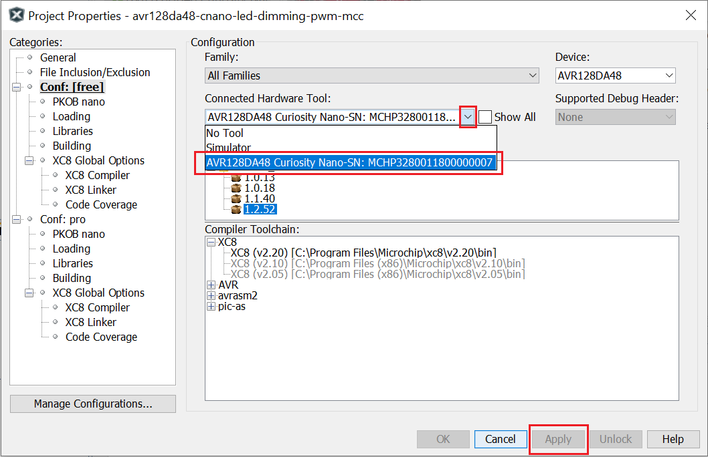

 <article class="markdown-body entry-content p-3 p-md-6" itemprop="This needs to locked down and 'never' changed">

 # AVR128DA48 LED Dimming Using PWM Code Example

This repository provides a MPLAB X project with a bare MCC generated code example for an LED dimming implemented using a PWM signal.
The example demonstrates the basic functionality of Timer/Counter Type A (TCA) used to generate a PWM signal. The output waveform is connected to the on-board LED. The PWM duty cycle value is incremented continuously until it reaches the maximum value and then is reloaded to 0. This produces the dimming effect of the LED.

## Related Documentation
More details and code examples on the AVR128DA48 can be found at the following links:
- [AVR128DA48 Product Page](https://www.microchip.com/wwwproducts/en/AVR128DA28)
- [AVR128DA48 Code Examples on GitHub](https://github.com/microchip-pic-avr-examples?q=avr128da48)
- [AVR128DA48 Project Examples in START](https://start.atmel.com/#examples/AVR128DA48CuriosityNano)

## Software Used
- MPLAB® X IDE 5.40 or newer [(microchip.com/mplab/mplab-x-ide)](http://www.microchip.com/mplab/mplab-x-ide)
- MPLAB® XC8 2.20 or a newer compiler [(microchip.com/mplab/compilers)](http://www.microchip.com/mplab/compilers)
- MPLAB® Code Configurator (MCC) 3.95.0 or newer [(microchip.com/mplab/mplab-code-configurator)](https://www.microchip.com/mplab/mplab-code-configurator)
- MPLAB® Code Configurator (MCC) Device Libraries 8-bit AVR MCUs 2.3.0 or newer [(microchip.com/mplab/mplab-code-configurator)](https://www.microchip.com/mplab/mplab-code-configurator)
- AVR-Dx 1.2.52 or newer Device Pack

## Hardware Used
- AVR128DA48 Curiosity Nano [(DM164151)](https://www.microchip.com/Developmenttools/ProductDetails/DM164151)

## Setup
The AVR128DA48 Curiosity Nano Development Board is used as test platform
 

TCA1:
 - Single-slope PWM Mode
 - Compare channel 2 enabled
 - Input clock 4Mhz

The following configurations must be made for this project:

|Pin           | Configuration      |
| :----------: | :----------------: |
|PC6 (LED0)    | Digital Output     |

## Operation
1. Connect the board to the PC.

2. Open the *avr128da48-cnano-led-dimming-pwm-mcc.X* project in MPLAB® X IDE.

3. Set *avr128da48-cnano-led-dimming-pwm-mcc.X* project as main project. Right click on the project in the *Projects* tab and click *Set as Main Project*.

4. Select the *AVR128DA28 Curiosity Nano* in the *Connected Hardware Tool* section of the project settings:
  - Right click on the project and click *Properties*;
  - Click on the arrow right next to *Connected Hardware Tool*;
  - Select the *AVR128DA28 Curiosity Nano* (click on the SN), click *Apply* and then click *OK*:
 

5. Program the project to the board: right click on the project and click *Make and Program Device*.

Demo:
 

## Summary
The example demonstrates the basic functionality of Timer/Counter Type A (TCA) used to generate a PWM signal. The generated PWM signal produces the dimming effect of the on-board LED.
